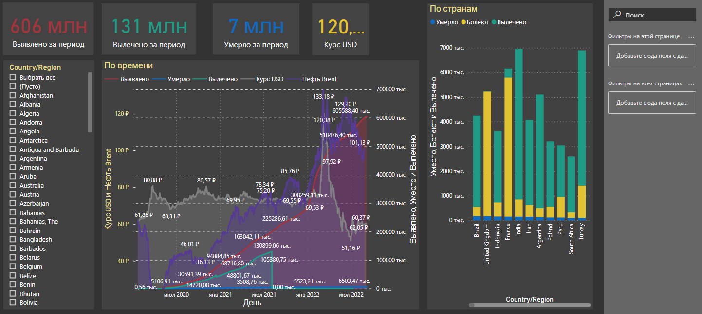

## Аналитический отчет по данным заражений Covid, ценам на нефть и курс доллара

Проект в Microsoft Power BI Desktop
- данные по ценам на нефть и курсу доллара подгружаются онлайн
- данные по короновирусу подгружаются из отдельного репозитория git-hub

### ПОДГОТОВКА
  - Создать копию репозитория - D:\#REPOSITORY\stat-covid19
    из - https://github.com/CSSEGISandData/COVID-19
  - Установить Microsoft Power BI Desktop
  - Открыть - covid-data.pbix
  - Нажнать команду главного экрана - Обновить
  
### ИСТОЧНИКИ ДАННЫХ
  
####   COVID-19 data
  
    https://github.com/CSSEGISandData/COVID-19
    
	from remote CSSEGISandData/COVID-19 to local repository in D:\#REPOSITORY\stat-covid19
  
####  USD currency
  
	http://www.cbr.ru/scripts/XML_dynamic.asp?date_req1=02/03/2020&date_req2=14/03/2020&VAL_NM_RQ=R01235
	
	date_req2 - формируется динамически на текущую дату
	  
    Получение данных, используя XML
    
	  https://www.cbr.ru/development/sxml/
	
####  BRENT OIL currency
  
	https://datahub.io/core/oil-prices/r/brent-daily.csv
	
### ИСТОРИЯ ВЕРСИЙ

2022-09-06 Актуализация данных

	Исправление ошибок преобразования целочисленного типа в поле Вылечено для ранних дат (точка > запятая)
	
	Обновлен путь до цен на нефть Brent - https://datahub.io/core/oil-prices/r/brent-daily.csv
	
2020-04-01 Новый формат ежедневных отчетов (с 22.03.2020)

2020-03-20 Добавлены данные и графики по 

2020-03-18 Первоначальная версия
